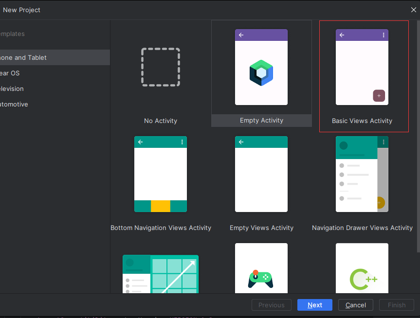
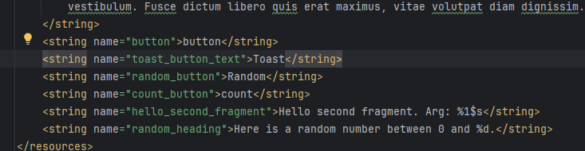
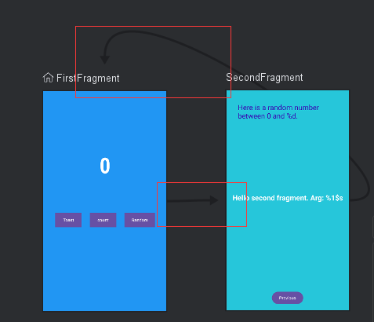
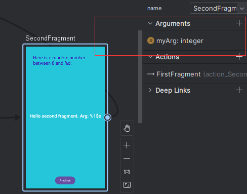
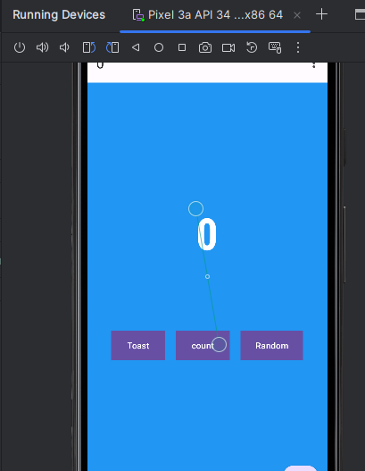
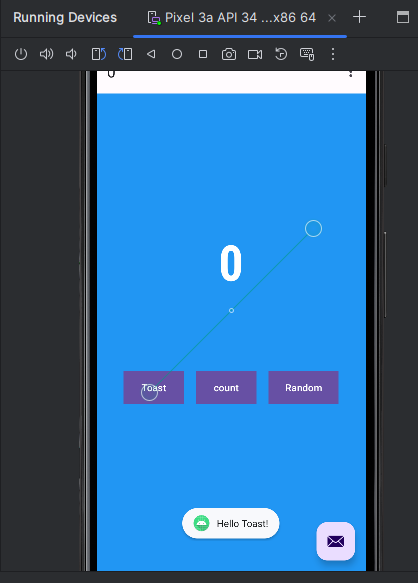
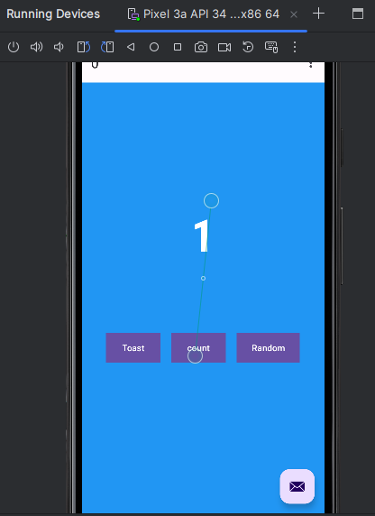
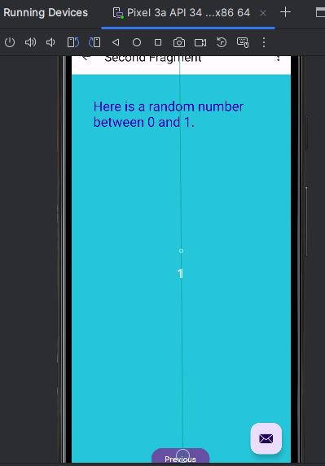

(跟老师教程一样的地方就简单带过,有些更改的地方会比较详细说明,androidstudio版本2023.2)

1. **创建工程**
    1. 选用的下图这个工程  
2. **设计界面**(由于我是做完了才来写的实验报告所以没有期间的模拟器界面截图)  
    *在fragment_first.xml为第一个界面设计三个button和一个textview*
    1. 设置toast按钮
    ```java
    <Button
            android:id="@+id/toast_button"
            android:layout_width="wrap_content"
            android:layout_height="wrap_content"
            android:layout_marginStart="24dp"
            android:background="@color/buttonBackground"//设置颜色
            android:text="@string/toast_button_text"//设置文本
            app:layout_constraintBottom_toBottomOf="parent"//设置底部约束为父布局的底部
            app:layout_constraintStart_toStartOf="parent"//设置起始位置为父布局的起始位置
            app:layout_constraintTop_toBottomOf="@+id/textview_first"//设置顶部约束为引号内的组件
            app:layout_constraintVertical_bias="0.3" />//垂直偏差
    ```
    设置文本时右键"@string/toast_button_text",选择goto,再选择declaration or usage会跳转到如下界面
      
    2. 设置count按钮
    ```java
    <Button
            android:id="@+id/count_button"
            android:layout_width="wrap_content"
            android:layout_height="wrap_content"
            android:layout_marginStart="24dp"
            android:background="@color/buttonBackground"//设置颜色
            android:text="@string/toast_button_text"//设置文本
            app:layout_constraintBottom_toBottomOf="parent"//设置底部约束为父布局的底部
            app:layout_constraintEnd_toStartOf="@+id/random_button"//设置结束为止为引号内组件的起始位置
            app:layout_constraintStart_toEndOf="@id/toast_button"//设置起始位置为父布局的起始位置
            app:layout_constraintTop_toBottomOf="@+id/textview_first"//设置顶部约束为引号内的组件
            app:layout_constraintVertical_bias="0.3" />//垂直偏差
    ```
    文字设置同上
    3. 设置random按钮
    ```java
    <Button
            android:id="@+id/random_button"
            android:layout_width="wrap_content"
            android:layout_height="wrap_content"
            android:layout_marginEnd="24dp"
            android:background="@color/buttonBackground"
            android:text="@string/random_button"
            app:layout_constraintBottom_toBottomOf="parent"
            app:layout_constraintEnd_toEndOf="parent"
            app:layout_constraintTop_toBottomOf="@+id/textview_first"
            app:layout_constraintVertical_bias="0.3" />
    ```
    文本设置同上
    4. 设置textview
    ```java
    <TextView
            android:id="@+id/textview_first"
            android:layout_width="wrap_content"
            android:layout_height="wrap_content"
            android:fontFamily="sans-serif-condensed"//设置字体
            android:text="@string/first_fragment_label"//设置文本
            android:textColor="@android:color/white"//设置文本颜色
            android:textSize="72sp"//字体大小
            android:textStyle="bold"//字体格式
            app:layout_constraintBottom_toBottomOf="parent"//以下为约束设置
            app:layout_constraintEnd_toEndOf="parent"
            app:layout_constraintStart_toStartOf="parent"
            app:layout_constraintTop_toTopOf="parent"
            app:layout_constraintVertical_bias="0.3" />
    ```
    5. 设置背景界面
    ```java
    <androidx.core.widget.NestedScrollView
    xmlns:android="http://schemas.android.com/apk/res/android"
    xmlns:app="http://schemas.android.com/apk/res-auto"
    xmlns:tools="http://schemas.android.com/tools"
    android:layout_width="match_parent"
    android:layout_height="match_parent"
    android:background="@color/screenBackground"//背景颜色
    tools:context=".FirstFragment">
    ```  
    
    *在fragment_second.xml为第二个界面设计两个文本和一个按钮*
    6. 添加second按钮
    ```java
    <Button
            android:id="@+id/button_second"
            android:layout_width="wrap_content"
            android:layout_height="wrap_content"
            android:text="@string/previous"
            app:layout_constraintBottom_toBottomOf="parent"
            app:layout_constraintEnd_toEndOf="parent"
            app:layout_constraintHorizontal_bias="0.498"
            app:layout_constraintStart_toStartOf="parent"
            app:layout_constraintTop_toTopOf="parent"
            app:layout_constraintVertical_bias="1.0" />
    ```
    7. 添加header文本
    ```java
    <TextView
            android:id="@+id/textview_header"
            android:layout_width="0dp"
            android:layout_height="wrap_content"
            android:layout_marginStart="24dp"
            android:layout_marginLeft="24dp"
            android:layout_marginTop="24dp"
            android:layout_marginEnd="24dp"
            android:layout_marginRight="24dp"
            android:text="@string/random_heading"
            android:textColor="@color/colorPrimaryDark"
            android:textSize="24sp"
            app:layout_constraintEnd_toEndOf="parent"
            app:layout_constraintStart_toStartOf="parent"
            app:layout_constraintTop_toTopOf="parent" />
    ```
    8. 添加random文本
    ```java
    <TextView
        android:id="@+id/textview_random"
        android:layout_width="wrap_content"
        android:layout_height="wrap_content"
        android:text="@string/hello_second_fragment"
        android:textColor="@android:color/white"
        android:textSize="24sp"
        android:textStyle="bold"
        app:layout_constraintBottom_toTopOf="@+id/button_second"
        app:layout_constraintEnd_toEndOf="parent"
        app:layout_constraintStart_toStartOf="parent"
        app:layout_constraintTop_toBottomOf="@+id/textview_header"
        app:layout_constraintVertical_bias="0.45" />
    ```
    至此完成了基本的页面布局设计
3. **设计交互**
    1. 修改firstFragment的onViewCreate方法

    ```java
    override fun onViewCreated(view: View, savedInstanceState: Bundle?) {
        super.onViewCreated(view, savedInstanceState)
        //根据id找到random按钮,并为random按钮添加事件
        view.findViewById<Button>(R.id.random_button).setOnClickListener {
            val showCountTextView = view.findViewById<TextView>(R.id.textview_first)
            val currentCount = showCountTextView.text.toString().toInt()
            //导航相关,下面第一行是传参,第二行是添加导航事件
            val action = FirstFragmentDirections.actionFirstFragmentToSecondFragment(currentCount)
            findNavController().navigate(action)
        }

        //根据id找到toast按钮,并为toast按钮添加事件
        view.findViewById<Button>(R.id.toast_button).setOnClickListener {
            // create a Toast with some text, to appear for a short time
            val myToast = Toast.makeText(context, "Hello Toast!", Toast.LENGTH_SHORT)
            // show the Toast
            myToast.show()
        }
        //根据id找到count按钮,并为count按钮添加事件,countme为随后定义的函数
        view.findViewById<Button>(R.id.count_button).setOnClickListener {
            countMe(view)
        }

        private fun countMe(view: View) {
        // Get the text view
        val showCountTextView = view.findViewById<TextView>(R.id.textview_first)

        // Get the value of the text view.
        val countString = showCountTextView.text.toString()

        // Convert value to a number and increment it
        var count = countString.toInt()
        count++

        // Display the new value in the text view.
        showCountTextView.text = count.toString()
    }
    }
    ```
    2. 修改secondfragment的onviewcreated方法
    ```java
    //添加导航
    val args: SecondFragmentArgs by navArgs()
    override fun onViewCreated(view: View, savedInstanceState: Bundle?) {
        super.onViewCreated(view, savedInstanceState)
        //为second按钮添加导航事件
        view.findViewById<Button>(R.id.button_second).setOnClickListener {
            findNavController().navigate(R.id.action_SecondFragment_to_FirstFragment)
        }
        //获取之前传来的count
        val count = args.myArg
        val countText = getString(R.string.random_heading, count)
        view.findViewById<TextView>(R.id.textview_header).text = countText
        //设置随机值并传给random文本
        val random = java.util.Random()
        var randomNumber = 0
        if (count > 0) {
            randomNumber = random.nextInt(count + 1)
        }
        view.findViewById<TextView>(R.id.textview_random).text = randomNumber.toString()
    }
    ```
    至此交互与导航的代码部分算是完成
4. **界面导航**
    1. 打开nav_graph.xml,为两个fragment设置导航,拉两条线就行,如下图
    
    我在此之外还为secondfragment添加了一个arguments,不然会在导航的代码部分报错
    
5. **运行**
    1. 初始界面  
    
    2. 点击toast  
    
    3. 点击count  
    
    4. 点击random  
    
    5. 点击previous  
    