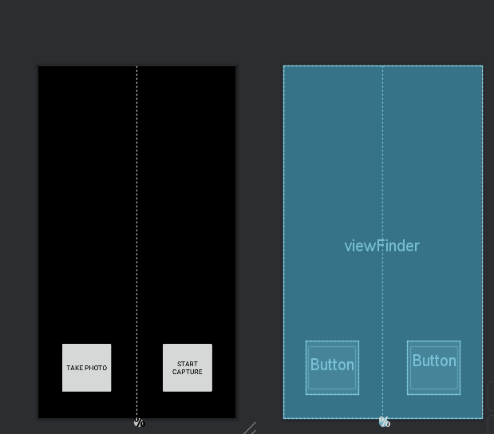
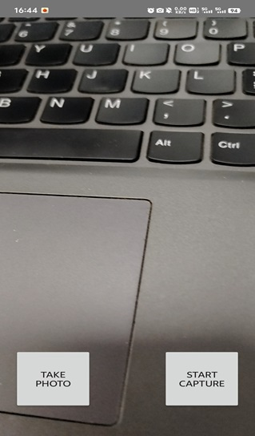
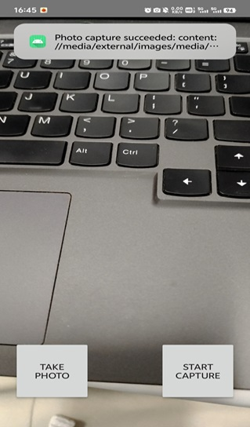
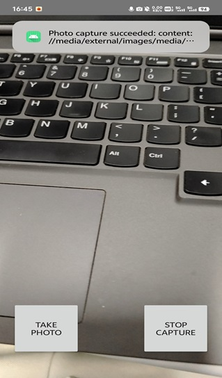
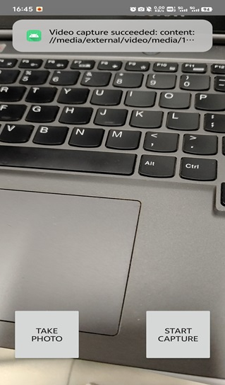

1. 创建项目
选择的是empty activity  

2. 添加gradle依赖
```java
dependencies {
    val camerax_version = "1.1.0-beta01"
    implementation("androidx.camera:camera-core:$camerax_version")
    implementation("androidx.camera:camera-camera2:$camerax_version")
    implementation("androidx.camera:camera-lifecycle:$camerax_version")
    implementation("androidx.camera:camera-video:$camerax_version")
    implementation("androidx.camera:camera-view:$camerax_version")
    implementation("androidx.camera:camera-extensions:$camerax_version")
    implementation("androidx.constraintlayout:constraintlayout:2.1.2")
}
```
因为在项目中使用了ViewBinding和dataBinding，在 android{} 代码块末尾添加如下代码：
```java
    buildFeatures {
        viewBinding = true
        dataBinding = true
    }
```
3. 创建项目布局  
在res/layout/下创建activity_main.xml，并将其替换为以下代码.  

```html
<?xml version="1.0" encoding="utf-8"?>
<androidx.constraintlayout.widget.ConstraintLayout
    xmlns:android="http://schemas.android.com/apk/res/android"
    xmlns:app="http://schemas.android.com/apk/res-auto"
    xmlns:tools="http://schemas.android.com/tools"
    android:layout_width="match_parent"
    android:layout_height="match_parent"
    tools:context=".MainActivity">

    <androidx.camera.view.PreviewView
        android:id="@+id/viewFinder"
        android:layout_width="match_parent"
        android:layout_height="match_parent" />

    <Button
        android:id="@+id/image_capture_button"
        android:layout_width="110dp"
        android:layout_height="110dp"
        android:layout_marginBottom="50dp"
        android:layout_marginEnd="50dp"
        android:elevation="2dp"
        android:text="@string/take_photo"
        app:layout_constraintBottom_toBottomOf="parent"
        app:layout_constraintLeft_toLeftOf="parent"
        app:layout_constraintEnd_toStartOf="@id/vertical_centerline" />

    <Button
        android:id="@+id/video_capture_button"
        android:layout_width="110dp"
        android:layout_height="110dp"
        android:layout_marginBottom="50dp"
        android:layout_marginStart="50dp"
        android:elevation="2dp"
        android:text="@string/start_capture"
        app:layout_constraintBottom_toBottomOf="parent"
        app:layout_constraintStart_toEndOf="@id/vertical_centerline" />

    <androidx.constraintlayout.widget.Guideline
        android:id="@+id/vertical_centerline"
        android:layout_width="wrap_content"
        android:layout_height="wrap_content"
        android:orientation="vertical"
        app:layout_constraintGuide_percent=".50" />

</androidx.constraintlayout.widget.ConstraintLayout>
```
更新res/values/strings.xml 文件
```xml
<resources>
   <string name="app_name">CameraXApp</string>
   <string name="take_photo">Take Photo</string>
   <string name="start_capture">Start Capture</string>
   <string name="stop_capture">Stop Capture</string>
</resources>
```
4. 编写 MainActivity.kt 代码(这是教程里面修改了很多次最终的代码了,我没有记录从最开始然后慢慢修改的过程)
```java
package com.example.camerax

import android.Manifest
import android.content.ContentValues
import android.content.pm.PackageManager
import android.os.Build
import android.os.Bundle
import android.provider.MediaStore
import android.util.Log
import android.widget.Toast
import androidx.appcompat.app.AppCompatActivity
import androidx.camera.core.CameraSelector
import androidx.camera.core.ImageAnalysis
import androidx.camera.core.ImageCapture
import androidx.camera.core.ImageCaptureException
import androidx.camera.core.ImageProxy
import androidx.camera.core.Preview
import androidx.camera.lifecycle.ProcessCameraProvider
import androidx.camera.video.FallbackStrategy
import androidx.camera.video.MediaStoreOutputOptions
import androidx.camera.video.Quality
import androidx.camera.video.QualitySelector
import androidx.camera.video.Recorder
import androidx.camera.video.Recording
import androidx.camera.video.VideoCapture
import androidx.camera.video.VideoRecordEvent
import androidx.core.app.ActivityCompat
import androidx.core.content.ContextCompat
import androidx.core.content.PermissionChecker
import java.util.concurrent.ExecutorService
import java.util.concurrent.Executors
import com.example.camerax.databinding.ActivityMainBinding
import java.nio.ByteBuffer
import java.text.SimpleDateFormat
import java.util.Locale

typealias LumaListener = (luma: Double) -> Unit

class MainActivity : AppCompatActivity() {
    private lateinit var viewBinding: ActivityMainBinding

    private var imageCapture: ImageCapture? = null

    private var videoCapture: VideoCapture<Recorder>? = null
    private var recording: Recording? = null

    private lateinit var cameraExecutor: ExecutorService

    override fun onCreate(savedInstanceState: Bundle?) {
        super.onCreate(savedInstanceState)
        viewBinding = ActivityMainBinding.inflate(layoutInflater)
        setContentView(viewBinding.root)

        // Request camera permissions
        if (allPermissionsGranted()) {
            startCamera()
        } else {
            ActivityCompat.requestPermissions(
                this, REQUIRED_PERMISSIONS, REQUEST_CODE_PERMISSIONS
            )
        }

        // Set up the listeners for take photo and video capture buttons
        viewBinding.imageCaptureButton.setOnClickListener { takePhoto() }
        viewBinding.videoCaptureButton.setOnClickListener { captureVideo() }

        cameraExecutor = Executors.newSingleThreadExecutor()
    }

    private fun takePhoto() {
        // Get a stable reference of the modifiable image capture use case
        val imageCapture = imageCapture ?: return

        // Create time stamped name and MediaStore entry.
        val name = SimpleDateFormat(FILENAME_FORMAT, Locale.US)
            .format(System.currentTimeMillis())
            //为了开始录制，创建一个新的录制会话。首先，创建预定的 MediaStore 视频内容对象，将系统时间戳作为显示名（以便可以捕获多个视频）。
        val contentValues = ContentValues().apply {
            put(MediaStore.MediaColumns.DISPLAY_NAME, name)
            put(MediaStore.MediaColumns.MIME_TYPE, "image/jpeg")
            if(Build.VERSION.SDK_INT > Build.VERSION_CODES.P) {
                put(MediaStore.Images.Media.RELATIVE_PATH, "Pictures/CameraX-Image")
            }
        }

        // Create output options object which contains file + metadata
        val outputOptions = ImageCapture.OutputFileOptions
            .Builder(contentResolver,
                MediaStore.Images.Media.EXTERNAL_CONTENT_URI,
                contentValues)
            .build()

        // Set up image capture listener, which is triggered after photo has
        // been taken
        imageCapture.takePicture(
            outputOptions,
            ContextCompat.getMainExecutor(this),
            object : ImageCapture.OnImageSavedCallback {
                override fun onError(exc: ImageCaptureException) {
                    Log.e(TAG, "Photo capture failed: ${exc.message}", exc)
                }

                override fun
                        onImageSaved(output: ImageCapture.OutputFileResults){
                    val msg = "Photo capture succeeded: ${output.savedUri}"
                    Toast.makeText(baseContext, msg, Toast.LENGTH_SHORT).show()
                    Log.d(TAG, msg)
                }
            }
        )
    }

    // Implements VideoCapture use case, including start and stop capturing.
    private fun captureVideo() {
        val videoCapture = this.videoCapture ?: return

        viewBinding.videoCaptureButton.isEnabled = false

        val curRecording = recording
        if (curRecording != null) {
            // Stop the current recording session.
            curRecording.stop()
            recording = null
            return
        }

        // create and start a new recording session
        val name = SimpleDateFormat(FILENAME_FORMAT, Locale.US)
            .format(System.currentTimeMillis())
        val contentValues = ContentValues().apply {
            put(MediaStore.MediaColumns.DISPLAY_NAME, name)
            put(MediaStore.MediaColumns.MIME_TYPE, "video/mp4")
            if (Build.VERSION.SDK_INT > Build.VERSION_CODES.P) {
                put(MediaStore.Video.Media.RELATIVE_PATH, "Movies/CameraX-Video")
            }
        }

        val mediaStoreOutputOptions = MediaStoreOutputOptions
            .Builder(contentResolver, MediaStore.Video.Media.EXTERNAL_CONTENT_URI)
            .setContentValues(contentValues)
            .build()
        recording = videoCapture.output
            .prepareRecording(this, mediaStoreOutputOptions)
            .apply {
                if (PermissionChecker.checkSelfPermission(this@MainActivity,
                        Manifest.permission.RECORD_AUDIO) ==
                    PermissionChecker.PERMISSION_GRANTED)
                {
                    withAudioEnabled()
                }
            }
            .start(ContextCompat.getMainExecutor(this)) { recordEvent ->
                when(recordEvent) {
                    //完成录制后，用消息框通知用户，并将“Stop Capture”按钮切换回“Start Capture”，然后重新启用它：
                    is VideoRecordEvent.Start -> {
                        viewBinding.videoCaptureButton.apply {
                            text = getString(R.string.stop_capture)
                            isEnabled = true
                        }
                    }
                    is VideoRecordEvent.Finalize -> {
                        if (!recordEvent.hasError()) {
                            val msg = "Video capture succeeded: " +
                                    "${recordEvent.outputResults.outputUri}"
                            Toast.makeText(baseContext, msg, Toast.LENGTH_SHORT)
                                .show()
                            Log.d(TAG, msg)
                        } else {
                            recording?.close()
                            recording = null
                            Log.e(TAG, "Video capture ends with error: " +
                                    "${recordEvent.error}")
                        }
                        viewBinding.videoCaptureButton.apply {
                            text = getString(R.string.start_capture)
                            isEnabled = true
                        }
                    }
                }
            }
    }

    private fun startCamera() {
        val cameraProviderFuture = ProcessCameraProvider.getInstance(this)

        cameraProviderFuture.addListener({
            // Used to bind the lifecycle of cameras to the lifecycle owner
            val cameraProvider: ProcessCameraProvider = cameraProviderFuture.get()

            // Preview
            val preview = Preview.Builder()
                .build()
                .also {
                    it.setSurfaceProvider(viewBinding.viewFinder.surfaceProvider)
                }
            val recorder = Recorder.Builder()
                .setQualitySelector(QualitySelector.from(Quality.HIGHEST,
                    FallbackStrategy.higherQualityOrLowerThan(Quality.SD)))
                .build()
            videoCapture = VideoCapture.withOutput(recorder)

            imageCapture = ImageCapture.Builder().build()


            val imageAnalyzer = ImageAnalysis.Builder().build()
                .also {
                    it.setAnalyzer(
                        cameraExecutor,
                        LuminosityAnalyzer { luma ->
                            Log.d(TAG, "Average luminosity: $luma")
                        }
                    )
                }


            // Select back camera as a default
            val cameraSelector = CameraSelector.DEFAULT_BACK_CAMERA

            try {
                // Unbind use cases before rebinding
                cameraProvider.unbindAll()

                // Bind use cases to camera
                cameraProvider.bindToLifecycle(
                    this, cameraSelector, preview, imageCapture, videoCapture)

            } catch(exc: Exception) {
                Log.e(TAG, "Use case binding failed", exc)
            }

        }, ContextCompat.getMainExecutor(this))
    }

    private fun allPermissionsGranted() = REQUIRED_PERMISSIONS.all {
        ContextCompat.checkSelfPermission(
            baseContext, it) == PackageManager.PERMISSION_GRANTED
    }

    override fun onDestroy() {
        super.onDestroy()
        cameraExecutor.shutdown()
    }

    companion object {
        private const val TAG = "CameraXApp"
        private const val FILENAME_FORMAT = "yyyy-MM-dd-HH-mm-ss-SSS"
        private const val REQUEST_CODE_PERMISSIONS = 10
        private val REQUIRED_PERMISSIONS =
            mutableListOf (
                Manifest.permission.CAMERA,
                Manifest.permission.RECORD_AUDIO
            ).apply {
                if (Build.VERSION.SDK_INT <= Build.VERSION_CODES.P) {
                    add(Manifest.permission.WRITE_EXTERNAL_STORAGE)
                }
            }.toTypedArray()
    }
    override fun onRequestPermissionsResult(
        requestCode: Int, permissions: Array<String>, grantResults:
        IntArray) {
        super.onRequestPermissionsResult(requestCode, permissions, grantResults)
        if (requestCode == REQUEST_CODE_PERMISSIONS) {
            if (allPermissionsGranted()) {
                startCamera()
            } else {
                Toast.makeText(this,
                    "Permissions not granted by the user.",
                    Toast.LENGTH_SHORT).show()
                finish()
            }
        }
    }
}
private class LuminosityAnalyzer(private val listener: LumaListener) : ImageAnalysis.Analyzer {

    private fun ByteBuffer.toByteArray(): ByteArray {
        rewind()    // Rewind the buffer to zero
        val data = ByteArray(remaining())
        get(data)   // Copy the buffer into a byte array
        return data // Return the byte array
    }

    override fun analyze(image: ImageProxy) {

        val buffer = image.planes[0].buffer
        val data = buffer.toByteArray()
        val pixels = data.map { it.toInt() and 0xFF }
        val luma = pixels.average()

        listener(luma)

        image.close()
    }
}
```
5. 请求必要的权限
```xml
<uses-feature android:name="android.hardware.camera.any" />
<uses-permission android:name="android.permission.CAMERA" />
<uses-permission android:name="android.permission.RECORD_AUDIO" />
<uses-permission android:name="android.permission.WRITE_EXTERNAL_STORAGE"
   android:maxSdkVersion="28" />

``` 
6. 运行截图  

功能正常  

拍照后有提示  

stop capture表示正在录屏,从提示可以看出录屏时也能拍照  

从提示可以看出视频录成功了