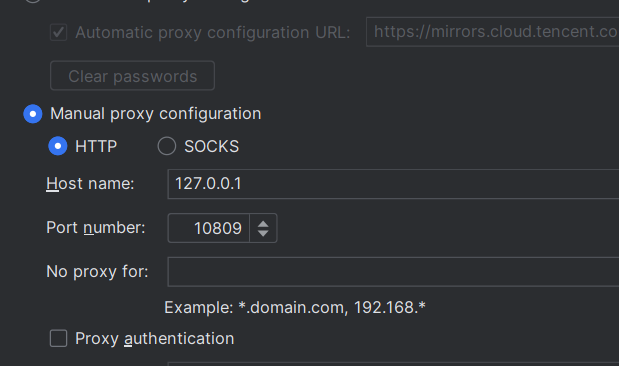
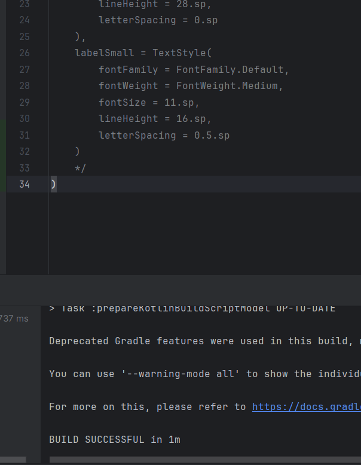
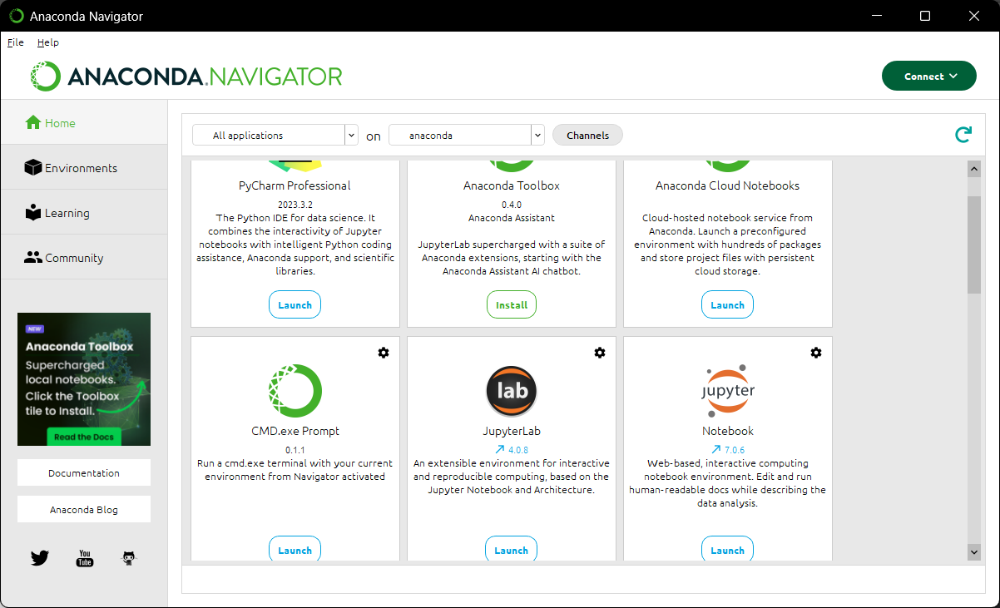
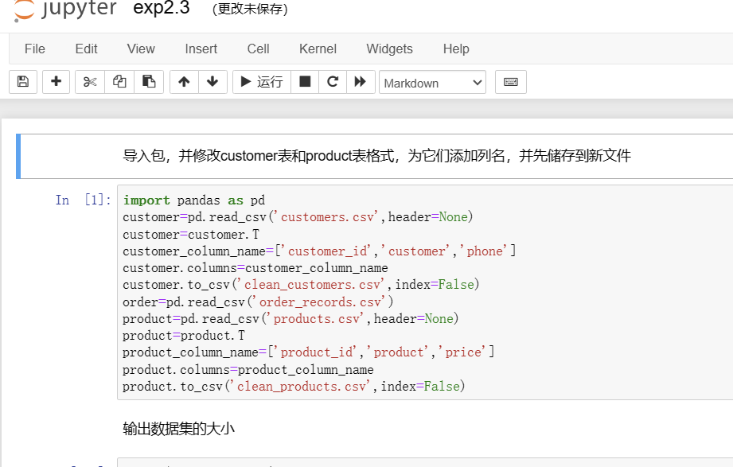
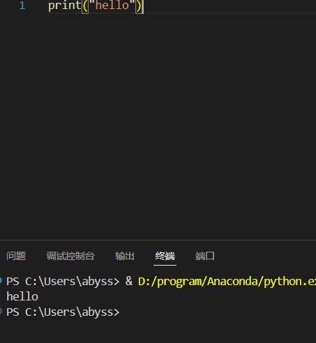

# 实验一软件安装过程

1. android studio安装
   1. 官网下载(下载后安装时也可能存在sdk无法下载的情况,这种时候需要开梯子)
   2. 设置代理(根据自己的端口设置,电脑搜索更改代理设置查看自己的端口)  
   
   3. 创建一个测试程序运行显示success  
   

2. anaconda 安装
   1. 因为我之前上课安装过anaconda,所以对我而言这部分没有需要注意的地方,当时安装也存在打开报错,我当时是环境变量有问题,而且anaconda好像更新后会影响创建的环境,在这个课之前有两三个月没用anaconda,打开后提示更新,我更新后环境就只剩下base了,不过base内的包倒是没少,也不知道是不是因为这个.  
   
3. jupyter安装
   1. 也在之前安装过,这里存在pip命令行安装和anaconda内安装,之前pip安装的,现在卸掉了之前的然后用anaconda重新装了一次,不然和anaconda关联不上  
   
   2. 更改默认路径可以通过每次使用命令行
   jupyter notebook --notebook-dir=/path/to/your/directory
   或则修改配置文件位于用户目录下的
   **~/.jupyter/jupyter_notebook_config.py'**,内有一行  
   **c.ServerApp.notebook_dir = 'D:aabb\python'**,配置文件的写法必须像这样,否则不起作用
4. vscode安装
   1. 也在之前安装过,这个大一学c语言就用过,但给我的印象是调试不方便,大一的时候用这个调试c语言总是隔一段时间就失败,应该是当时的我对这些没什么经验  
   