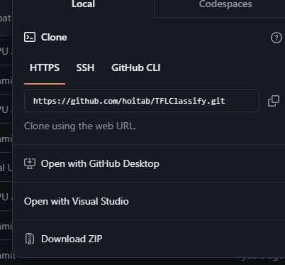
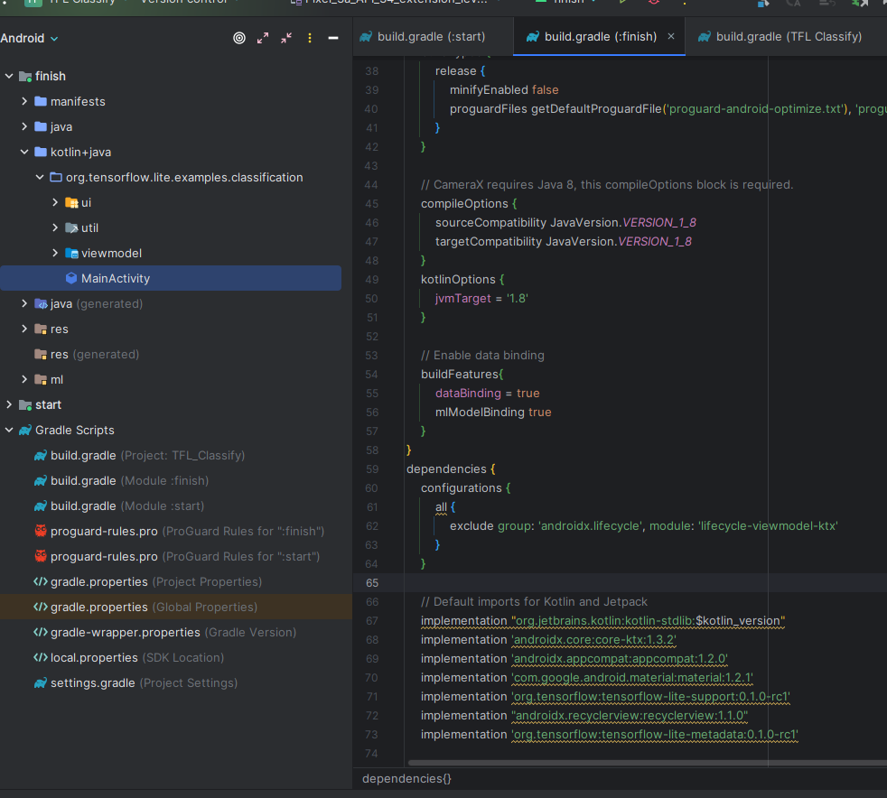
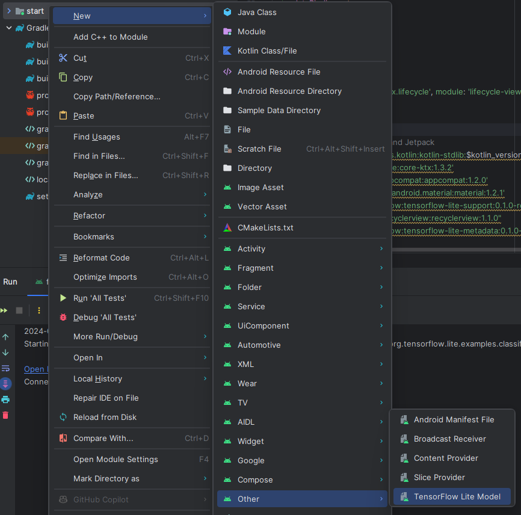
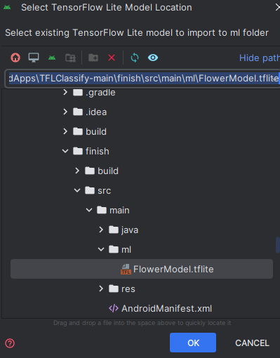
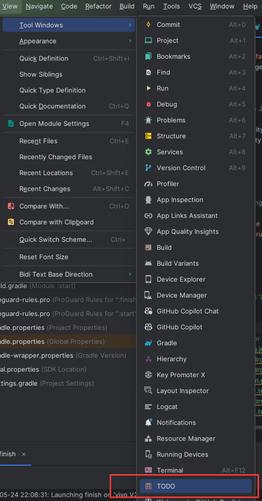
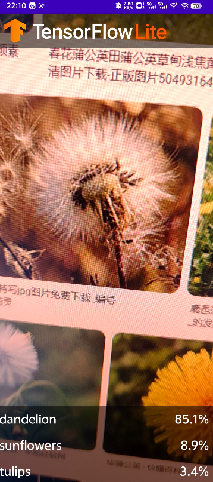
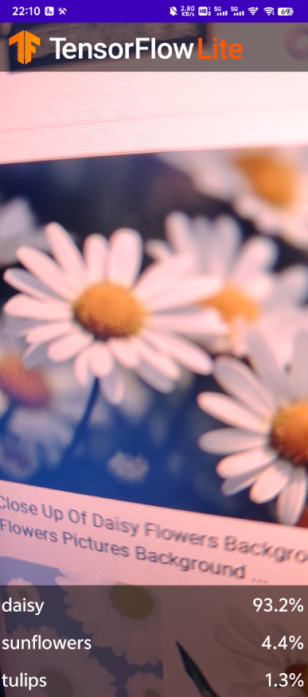
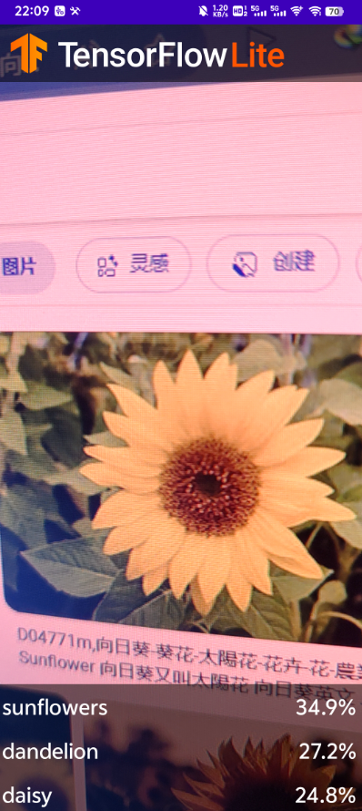

1. 下载代码  
用zip方式下载解压然后用androidstudio打开  
  
打开后界面如下  

2. 向应用添加TensorFlowlite模块  
  
选择finish内的模块  

3. 检查todo项并完成
按照图片依次点击折叠栏  
然后添加todo1内容,添加初始化训练模型的代码  
  
```java
 // TODO 1: Add class variable TensorFlow Lite Model
        // Initializing the flowerModel by lazy so that it runs in the same thread when the process
        // method is called.
        private val flowerModel = FlowerModel.newInstance(ctx)
```
再添加todo2的内容,在CameraX的analyze方法内部，需要将摄像头的输入ImageProxy转化为Bitmap对象，并进一步转化为TensorImage 对象
```java
 override fun analyze(imageProxy: ImageProxy) {

            val items = mutableListOf<Recognition>()

            // TODO 2: Convert Image to Bitmap then to TensorImage
            val tfImage = TensorImage.fromBitmap(toBitmap(imageProxy))
```
todo3,按照属性对识别结果高到低排序,列出最高的k种可能
```java
 override fun analyze(imageProxy: ImageProxy) {

            val items = mutableListOf<Recognition>()

            // TODO 2: Convert Image to Bitmap then to TensorImage
            val tfImage = TensorImage.fromBitmap(toBitmap(imageProxy))
```
todo4,将识别的结果加入数据对象Recognition 中，包含label和score两个元素。后续将用于RecyclerView的数据显示
```java
// TODO 4: Converting the top probability items into a list of recognitions
            for (output in outputs) {
                items.add(Recognition(output.label, output.score))
            }
```
todo5,将原先用于虚拟显示识别结果的代码注释掉或者删除
```java
            // START - Placeholder code at the start of the codelab. Comment this block of code out.
            for (i in 0..MAX_RESULT_DISPLAY-1){
                items.add(Recognition("Fake label $i", Random.nextFloat()))
            }
            // END - Placeholder code at the start of the codelab. Comment this block of code out.
```
除了这些步骤外,由于运行环境的些许不同,就本人的环境而言,在build.gradle(start)添加了以下代码才得以运行
```
dependencies {
    configurations {
        all {
            exclude group: 'androidx.lifecycle', module: 'lifecycle-viewmodel-ktx'
        }
    }
```
不然会出现类重复问题,无法运行  
5. 运行
连接好手机后运行界面如下  
识别蒲公英  
  
识别雏菊  
  
识别向日葵  
  
可见向日葵的识别率不是很高